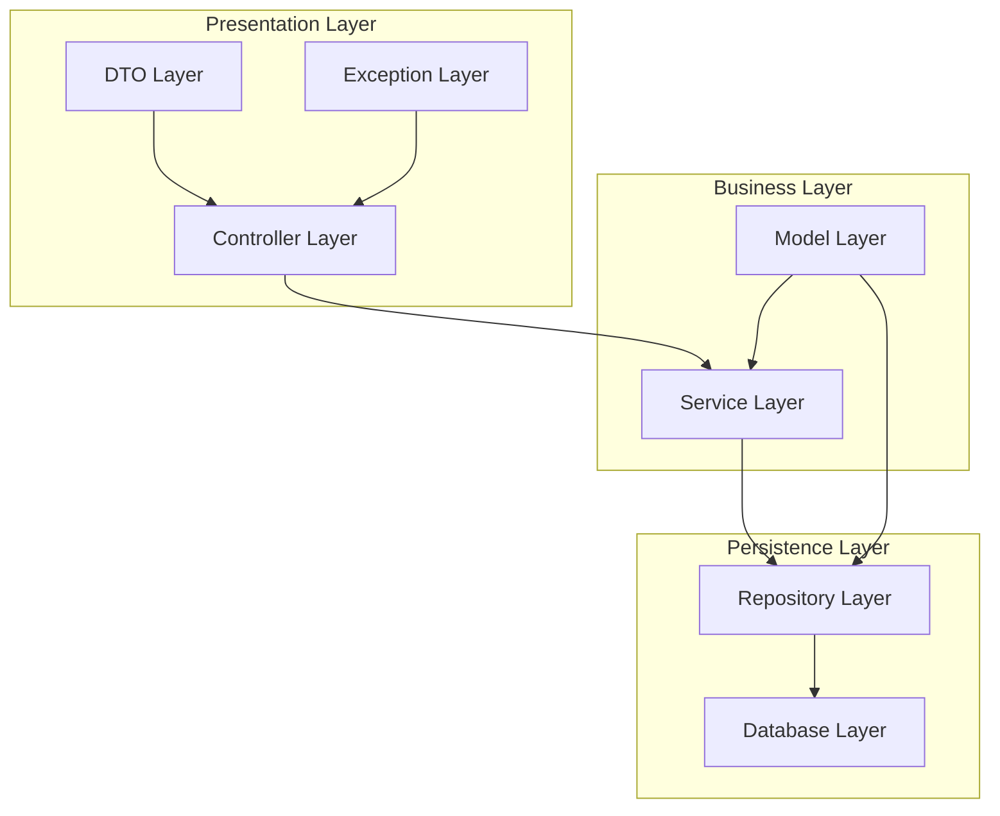

# Adopet API

## 📋 Descrição

A **Adopet API** é uma aplicação REST desenvolvida em Java com Spring Boot para gerenciar um sistema de adoção de pets. O sistema permite o cadastro de tutores, pets e o gerenciamento do processo de adoção, conectando pessoas que desejam adotar animais com aqueles que precisam encontrar um novo lar para seus pets.

## 🛠️ Tecnologias Utilizadas

- **Java 17**
- **Spring Boot 3.1.4**
- **Spring Web** - Para criação da API REST
- **Spring Data JPA** - Para persistência de dados
- **Spring Boot Validation** - Para validação de dados
- **MySQL** - Banco de dados relacional
- **Flyway** - Controle de versão do banco de dados
- **Lombok** - Redução de código boilerplate
- **Maven** - Gerenciamento de dependências
- **JUnit 5** - Testes unitários

## 🏗️ Arquitetura em Camadas

A aplicação segue o padrão de arquitetura em camadas (Layered Architecture), proporcionando separação de responsabilidades e facilidade de manutenção:



### Descrição das Camadas:

#### 🎮 **Controller Layer** (Camada de Apresentação)
- **Responsabilidade**: Receber requisições HTTP, validar entrada e retornar respostas
- **Componentes**: `AdocaoController`, `PetController`, `TutorController`
- **Função**: Interface entre o cliente e a aplicação

#### 🔧 **Service Layer** (Camada de Negócio)
- **Responsabilidade**: Implementar regras de negócio e lógica da aplicação
- **Componentes**: `AdocaoService`, `PetService`, `TutorService`, `ImageStorageService`
- **Função**: Processar dados e aplicar validações de negócio

#### 🗃️ **Repository Layer** (Camada de Persistência)
- **Responsabilidade**: Acesso e manipulação de dados no banco
- **Componentes**: `AdocaoRepository`, `PetRepository`, `TutorRepository`
- **Função**: Abstração para operações no banco de dados

#### 📊 **Model Layer** (Camada de Modelo)
- **Responsabilidade**: Representar entidades do domínio
- **Componentes**: `Adocao`, `Pet`, `Tutor`, `StatusAdocao`, `TipoPorte`, `TipoPet`
- **Função**: Mapear estrutura do banco de dados

#### 📝 **DTO Layer** (Transferência de Dados)
- **Responsabilidade**: Transferir dados entre camadas
- **Componentes**: `AdocaoDTO`, `PetDTO`, `TutorDTO`, `CadastroPetDTO`, etc.
- **Função**: Controlar exposição de dados e validações

#### ⚠️ **Exception Layer** (Tratamento de Exceções)
- **Responsabilidade**: Gerenciar erros e exceções da aplicação
- **Componentes**: `GlobalExceptionHandler`, `AdocaoException`, `ResponseError`
- **Função**: Padronizar retorno de erros

## 🚀 Como Executar

### Pré-requisitos
- Java 17 ou superior
- MySQL Server
- Maven 3.6 ou superior

### Passos para execução:

1. **Clone o repositório**
```bash
git clone <repository-url>
cd java-exceptions
```

2. **Configure o banco de dados**
   - Crie um banco MySQL local
   - Ajuste as configurações em `src/main/resources/application.properties`

3. **Execute a aplicação**
```bash
./mvnw spring-boot:run
```

4. **Acesse a aplicação**
   - URL: `http://localhost:8080`

## 📁 Estrutura do Projeto

```
src/
├── main/
│   ├── java/adopet/api/
│   │   ├── controller/     # Controladores REST
│   │   ├── service/        # Lógica de negócio
│   │   ├── repository/     # Acesso a dados
│   │   ├── model/          # Entidades JPA
│   │   ├── dto/            # Data Transfer Objects
│   │   └── exception/      # Tratamento de exceções
│   └── resources/
│       ├── application.properties
│       └── db/migration/   # Scripts Flyway
└── test/                   # Testes unitários
```

## 🔧 Configuração

A aplicação utiliza as seguintes configurações principais:

- **Porta do servidor**: 8080
- **Banco de dados**: MySQL (localhost)
- **Migração automática**: Flyway
- **JPA**: Hibernate como implementação

## 📄 API Endpoints

A API oferece endpoints para:

- **Tutores**: Cadastro e consulta de tutores
- **Pets**: Cadastro e consulta de pets disponíveis para adoção
- **Adoções**: Gerenciamento do processo de adoção

## 🧪 Testes

Execute os testes com:
```bash
./mvnw test
```

---

**Desenvolvido por:** Leonardo Jaques  
**Email:** jaques.projetos@outlook.com
