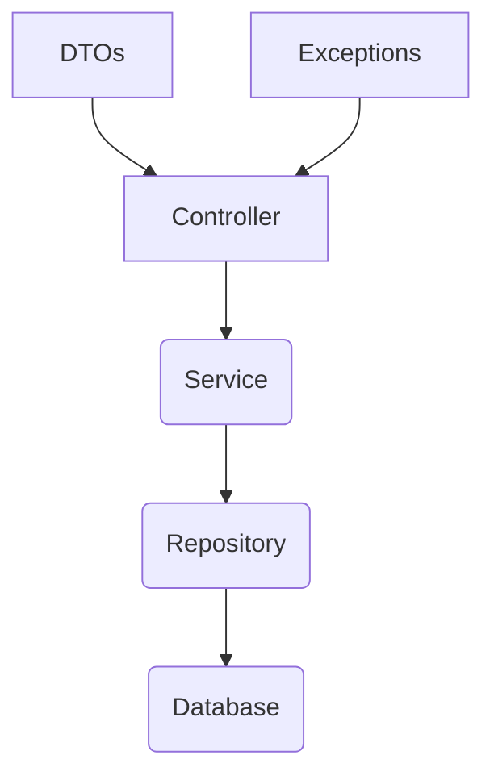

# Adopet API

API Rest for the Adopet application, a platform for pet adoption.

## Technologies Used

*   **Java**: 17
*   **Spring Boot**: 3.1.4
*   **Maven**
*   **JPA / Hibernate**: For data persistence.
*   **Flyway**: For database migrations.
*   **MySQL**: As the database.
*   **Lombok**: To reduce boilerplate code.

## Architecture

The application follows a layered architecture:



- **Controller**: Handles HTTP requests, validates input, and returns responses.
- **Service**: Contains the business logic of the application.
- **Repository**: Responsible for data access and persistence.
- **Database**: Stores the application data.
- **DTOs**: Data Transfer Objects used to transfer data between layers.
- **Exceptions**: Custom exceptions to handle application-specific errors.

## Running the project

To run the project, you can use the following Maven command:

```bash
./mvnw spring-boot:run
```

## Author

**Name**: leonardo jaques
**Email**: jaques.projetos@outlook.com
